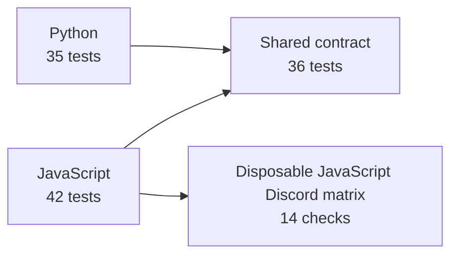
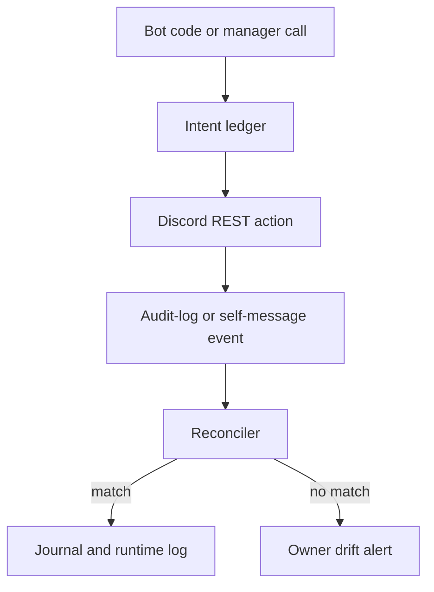

# Project Parity Test Report

**Release under test:** 1.7.1  
**Scope:** local deterministic suite plus disposable live Discord matrices through 2026-08-31.

## Coverage at a glance

The local suite contains **113 tests** across three deliberately different categories. A category is not merely a language label: it exercises a different failure surface.

| Category | Tests | Primary purpose |
| --- | ---: | --- |
| JavaScript | 42 | discord.js attachment, manager auto-tracking, runtime/CLI, reconciliation |
| Python | 35 | discord.py-style attachment, manual recording workflow, runtime/CLI, reconciliation |
| Other (contract, cross-language, release) | 36 | shared schema, byte parity, documentation, packaging, repository hygiene |



## What the suite follows



The first visual shows independent runtime coverage converging on the shared contract. The second shows the tested responsibility boundary: Parity compares delivered Discord evidence against recorded code intent; it does not inspect arbitrary source code at runtime.

## Test map

| Suite | Tests | Designs and behaviors exercised |
| --- | ---: | --- |
| `parity-js/test/core.test.mjs` | 22 | Ledger and reconciliation boundaries, audit/message listener behavior, owner alert cards, generated-ID race protection, journal records, SQLite adapter, adversarial inputs |
| `parity-js/test/deep.test.mjs` | 5 | Timing matrix, seeded fuzzing, 10,000-entry collapsed burst, 1,000 concurrent matches, 50,000-entry purge |
| `parity-js/test/cli.test.mjs` | 3 | Runtime state, bounded logs, CLI settings, health/check output |
| `parity-js/test/doctor.test.mjs` | 3 | Private alert channel, permission failures, tracked onboarding message |
| `parity-js/test/auto-wrap.test.mjs` | 9 | Disabled wrapper, guild and nested manager paths, expanded emoji/sticker/invite/event/AutoMod coverage, rejected creates, observer failure isolation |
| `parity-py/tests/test_core.py` | 19 | discord.py and py-cord listener shapes, ledger/reconciler, V2 delivery fallback, journal, target normalization, SQLite, adversarial inputs |
| `parity-py/tests/test_deep.py` | 4 | Timing, fuzzing, burst size, concurrency |
| `parity-py/tests/test_cli.py` | 3 | Runtime store and operator CLI behavior |
| `parity-py/tests/test_doctor.py` | 3 | Onboarding doctor and tracked confirmation message |
| `parity-py/tests/test_manual_workflows.py` | 6 | Explicit Python intent/track workflows, generated IDs, rejected calls, self-messages, guild isolation |
| `tests/spec.test.mjs` | 6 | JSON schemas, canonical targets, reconciliation rules, installed discord.js action enum |
| `tests/cross-language.test.mjs` | 3 | Byte-identical reports, journals, and owner-facing text across runtimes |
| `tests/release-readiness.test.mjs` | 24 | Report/README linkage, command and release parity, CI/release workflow requirements, release versions, schemas, fixtures, action-map uniqueness, setup guidance, Components V2 live-alert detection, live-chaos safeguards, fixture-capture hygiene, ignored credentials/runtime files |
| `tests/bot-matrix.test.mjs` | 3 | 100 distinct profiles, 50 JavaScript baseline/Parity paths, 50 Python baseline/Parity paths |

## Different bot designs covered

“Different” means a meaningful difference in how a bot reaches Discord or receives events, not the same assertion repeated with renamed data.

| Design | Test representation | What it establishes |
| --- | --- | --- |
| discord.js manager bot | Cached guild role/channel/member/ban managers | `autoWrap: true` records supported manager calls before or after the REST operation as required by target ID availability |
| Multi-guild discord.js bot | Existing and later `guildCreate` guilds | The wrapper attaches to cached managers and to a guild delivered after startup, then restores originals on detach |
| EventEmitter-based bot | Standard discord.js-style event emitter | Audit and self-message listeners reconcile expected actions and report rogue ones |
| Plain Python client | Client with instance `on_*` handlers and no listener API | Attachment composes host handlers and restores them on detach |
| Listener-based Python client | Client exposing `add_listener`/`remove_listener` | Attachment registers the audit and message handlers without replacing host behavior |
| Python service/manual bot | Explicit `intent` and result-derived `track` calls | Target-known actions, generated IDs, rejected operations, and self-messages retain their intended reconciliation behavior |
| Cross-runtime deployment | Fixture drivers in JavaScript and Python | Canonical drift reports and journals match byte-for-byte for the shared fixture set |

## Commands and evidence

Run the deterministic suite from the repository root:

```sh
npm test
```

This runs the 36 other tests, 42 JavaScript tests, and 35 Python tests. Python’s test runner emits occasional asyncio slow-task diagnostics on this machine during large concurrency cases; the suite still exits successfully and treats them as performance diagnostics, not assertions.

The disposable live matrix is separate because it creates and removes Discord channels, roles, webhooks, and messages in a dedicated guild:

```sh
npm run live-test
```

The latest run passed **14/14 checks** on 2026-08-29. It verified unrecorded drift, manual recording, `autoWrap: true` channel/role reconciliation, self-message tracking, permissions, and a 1,000-operation offline concurrency check. It is evidence for the tested account and permissions at that time, not a guarantee about every Discord configuration.

For a real Discord stress run, use `npm run live-test:chaos`. It submits 100 tracked bot messages by default, requires at least 100 operations, then verifies a real channel-update audit probe after the burst. It removes its test channel. Set `PARITY_CHAOS_MUTATIONS` from 100 through 1,000 to change the size.

The 2026-08-31 live chaos run passed **3/3 checks**: 100/100 real bot messages reconciled, the ledger returned to zero entries without drift, and a post-burst channel-update audit entry reconciled. The same session captured reviewed sanitized channel-create and channel-update shapes in `parity-spec/observed-fixtures/discordjs-live-chaos.json`.

The 2026-08-31 live bot matrix passed **2/2 checks**: each of the 100 catalog profiles sent a baseline output without Parity, then each sent a tracked output with Parity. All 100 tracked outputs reconciled with zero drift and zero residual ledger entries. The matrix deletes its dedicated channel afterward.

## Boundaries and remaining gaps

- JavaScript automatic tracking covers documented guild role, channel, member, ban, emoji, sticker, invite, scheduled-event, and AutoMod managers plus channel permission overwrites and thread creation. Message sends, standalone webhooks, and APIs outside this manager set still need explicit `track(...)` or `intent(...)`.
- Python has no automatic outbound wrapper. Its tests validate the manual integration path rather than claiming parity with JavaScript’s manager proxy.
- Discord only provides what its audit-log and gateway surfaces deliver. Actions Discord does not audit, events lost before delivery, and API surfaces outside the coverage map cannot be proven by this project.
- The live matrix uses one disposable guild and one permission profile. It does not replace testing an application’s own commands, sharding, persistence choice, or deployment topology.
- Sanitized observed audit shapes are an advanced compatibility artifact, not automatically executable reconciliation fixtures. Review captures and promote only deterministic cases into `parity-spec/fixtures/` with cross-language assertions.

## Reading results without overclaiming

A passing suite means the documented ledger, reconciliation, alert, CLI, and release-contract behaviors passed under controlled inputs, plus the listed live Discord checks. It does not mean every possible bot architecture or Discord API call is automatically protected. Use `parity-doctor --send-test`, inspect `parity.getAutoWrapCoverage()` in JavaScript, and review `parity logs` after integrating a specific bot.
