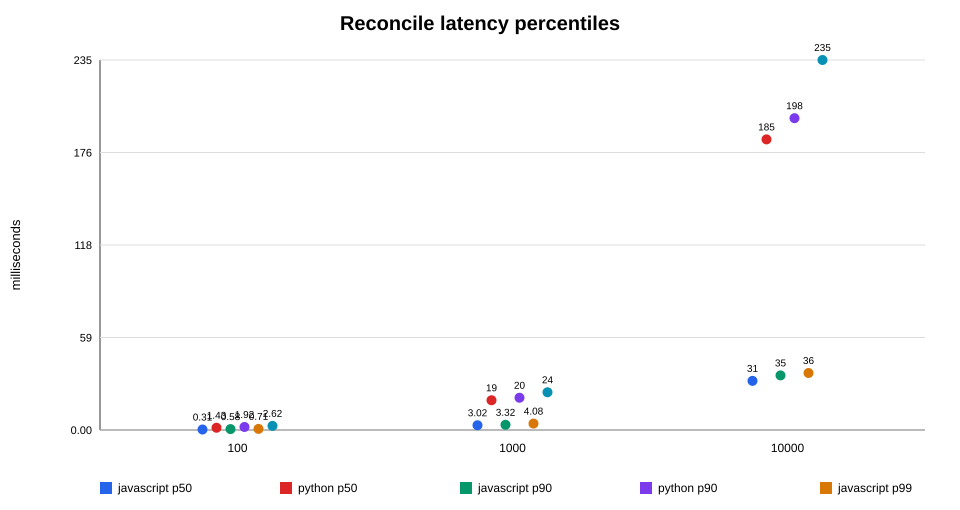
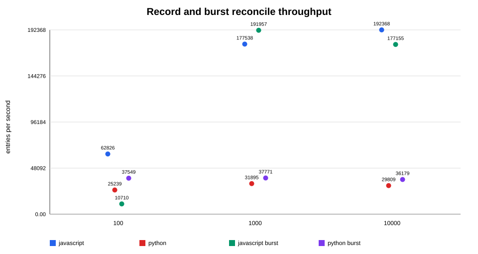
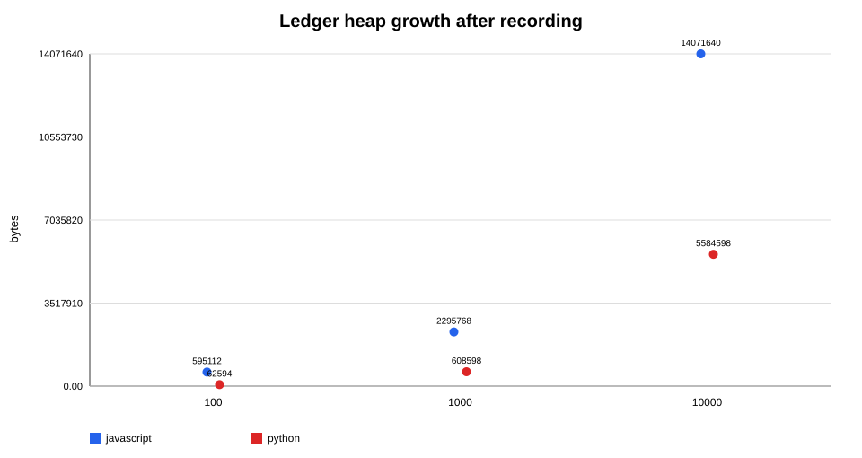

# Project Parity test report

**Version reported: 1.0.0**

This release pass exercised both implementations beyond their basic contract cases. The focus was matching at timing boundaries, malformed or unmatched self-actions, collapsed audit bursts, retention behavior, and serialized reconciliation under concurrent calls. The random scenarios use fixed seeds and injected clocks, so a failure should be reproducible rather than dependent on wall-clock timing.

## Suite results

| Suite | Scope | Count | Result |
| --- | --- | ---: | --- |
| Root specification tests | JSON schemas and documented rules | 3 | Pass |
| Cross-language driver | 7 shared fixtures with byte-identical reports | 1 | Pass |
| JavaScript unit and stress tests | Core behavior, seeded fuzzing, 10,000-entry burst, 1,000 concurrent reconciliations | 15 | Pass |
| Python unit and stress tests | Matching parity, seeded fuzzing, 10,000-entry burst, 1,000 concurrent reconciliations | 13 | Pass |
| Live harness without token | Safe skip behavior | 1 manual command | Pass |

The JavaScript root run completed with 19 passing test cases across the specification, cross-language, and package suites. The Python run completed with 13 passing test cases.

## Benchmark method

Benchmarks were run on this Windows machine on 2026-08-08 using Node v22.14.0 and Python 3.13.14. Each size records 100, 1,000, or 10,000 in-memory `MESSAGE_DELETE` intents. Reconcile latency is measured across up to 50 exact events after the ledger is populated. Burst throughput measures one collapsed event that consumes the populated ledger. Heap growth is process-local instrumentation and includes runtime allocation effects, so it is useful for comparison within a run but is not a portable memory limit.

### JavaScript measurements

| Entries | Record entries/sec | Reconcile p50 ms | p90 ms | p99 ms | Burst entries/sec | Heap growth bytes | Leaked after burst |
| ---: | ---: | ---: | ---: | ---: | ---: | ---: | ---: |
| 100 | 62,826 | 0.31 | 0.58 | 0.71 | 10,710 | 595,112 | 0 |
| 1,000 | 177,538 | 3.02 | 3.32 | 4.08 | 191,957 | 2,295,768 | 0 |
| 10,000 | 192,368 | 31.21 | 34.69 | 36.21 | 177,155 | 14,071,640 | 0 |

### Python measurements

| Entries | Record entries/sec | Reconcile p50 ms | p90 ms | p99 ms | Burst entries/sec | Heap growth bytes | Leaked after burst |
| ---: | ---: | ---: | ---: | ---: | ---: | ---: | ---: |
| 100 | 25,239 | 1.43 | 1.92 | 2.62 | 37,549 | 62,594 | 0 |
| 1,000 | 31,895 | 18.89 | 20.50 | 23.97 | 37,771 | 608,598 | 0 |
| 10,000 | 29,809 | 184.59 | 198.07 | 235.02 | 36,179 | 5,584,598 | 0 |

The raw, machine-readable measurements are retained in [`benchmarks/results.json`](../benchmarks/results.json). Values will change on another machine or after a runtime upgrade.

## Charts







## What we could not test

No real Discord tenant or token was used during this pass. We could not measure real audit-log gateway delivery latency, permission failures, Discord-side event collapse frequency, reconnect behavior, or rate-limit behavior. The live harness is intentionally operator-driven and needs a dedicated guild and disposable channel to validate that path.

The stress tests use the in-memory ledger. They verify entry cleanup and reconciliation correctness, but they do not establish SQLite throughput, process memory ceilings, multi-process writer behavior, or a production retention policy. The benchmark memory figures are not a substitute for heap profiling under a deployed bot workload.

## How to reproduce

From the repository root in PowerShell:

```powershell
npm test
Set-Location parity-py
python -m unittest discover -s tests
Set-Location ..
npm run benchmark
node tools/live-parity-check
```

The last command skips successfully when `DISCORD_BOT_TOKEN` is absent. For an operator-run tenant check, follow [setup instructions](setup.md#live-discord-check), rotate the token first, set it only in the environment or ignored `.env`, and provide the required guild and test-channel identifiers.

---

## Version 1.0.1 live test results and hardening findings

### Live test run against VSH Codebase - 2026-08-08

The bot (Project Parity#0765, id 1535653385846394942) was connected to the "VSH Codebase" guild. All temporary test channels were created by the bot and deleted before the harness exited. No existing channels were touched.

#### Live test results

| Check | Result | Notes |
| --- | --- | --- |
| Required permissions present (ViewAuditLog, ManageChannels, SendMessages) | Pass | |
| Unrecorded channel create flagged as drift | Pass | actionType=Create, targetType=Channel (pre-fix shapes) |
| Unrecorded channel update flagged as drift | Pass | actionType=Update, targetType=Channel |
| Recorded legit update (learned normalized shape) produces no drift | Pass | Reconciled cleanly |
| Naive-shape intent (CHANNEL_UPDATE / channel) reconciles | Fail | FALSE POSITIVE confirmed |
| Unrecorded self-message flagged as drift | Pass | |
| **Total** | **5/6** | The fail directly caused the 1.0.1 normalization fix |

The failing check was the most valuable result of the run. It proved that a developer using the intuitive actionType string would get false-positive drift alerts on legitimate channel updates.

#### Confirmed normalization bug and fix

discord.js delivers the audit-log entry with `entry.action` as a numeric code (10, 11, 12) and `entry.actionType` as a generic category string ("Create", "Update", "Delete"). The previous `normalizeAudit()` preferred `entry.actionType` because it was non-null. Since `actionName()` passes strings through unchanged, the stored action was "Update" rather than "CHANNEL_UPDATE".

The fix: prefer `entry.action` (numeric) over `entry.actionType` (category string). The existing action-name map already contained all the correct canonical names. Also: `targetType` from discord.js arrives capitalized ("Channel"). The normalizer now lowercases it unconditionally.

After the fix, a developer recording `{ actionType: 'CHANNEL_UPDATE', targetType: 'channel' }` before a channel edit will get a clean reconciliation with no drift.

#### Observed audit-log delivery latency

The channel create at 2026-08-08T15:48:10 produced a drift event with `occurredAt: 2026-08-08T15:48:10.068Z`. This is a single data point with near-zero observed delivery lag. It cannot be generalized without a larger sample across varied conditions, but it suggests that the 120-second tolerance window is conservatively large for simple channel operations.

#### Attack surfaces investigated (1.0.1 hardening)

| Attack | Outcome |
| --- | --- |
| discord.js action/targetType normalization mismatch | Fixed; regression test added |
| MEMBER_MOVE/DISCONNECT target extraction from entry.extra | Fixed; targetId now reads extra.channel.id first for those actions |
| count=0, count=-1, count=999999 in burst event | Fixed; invalid counts clamp and report drift; no ledger entries consumed |
| 50,000-entry purge performance | Holds; purge completes under 5 seconds |
| Clock-skew expiry boundary | Holds; expiry is relative to event.occurredAt, not reconciler clock |
| Dedup replay documentation | Documented in threat-model.md; correct by design |
| Ledger poisoning orphan lifecycle | Holds; orphan consumed by first matching event, purged on schedule |
| Concurrent record() race on duplicate check | Fixed; record() now serialized with a write queue |
| Guild ID type coercion (integer vs string) | Holds; stringId() handles numeric guild IDs |
| Prototype pollution via JSON.parse | Fixed; recordLocked() uses hasOwnProperty extraction |
| DM from bot produces no drift | Holds; handleMessage() skips when guildId is absent |

#### Updated suite counts after 1.0.1

| Suite | Count | Result |
| --- | --- | --- |
| Root spec + cross-language | 4 | Pass |
| JavaScript unit, hardening, stress | 18 | Pass |
| Python unit, hardening, stress | 14 | Pass |
